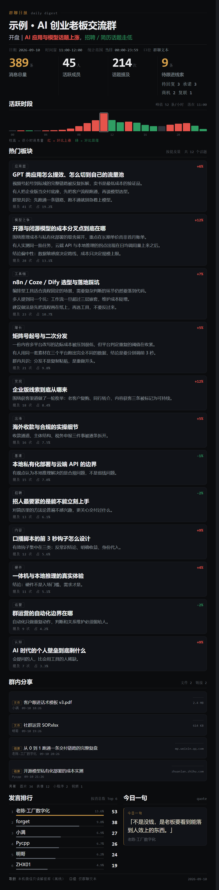
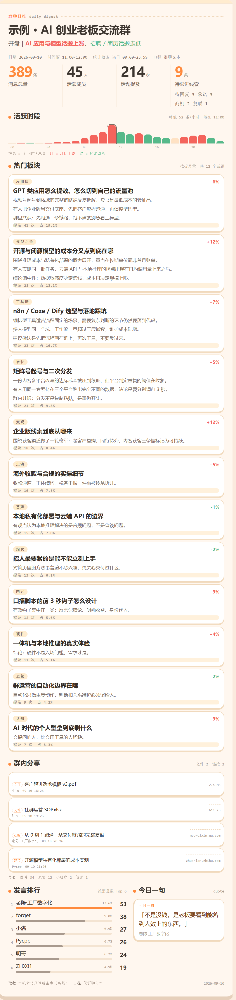
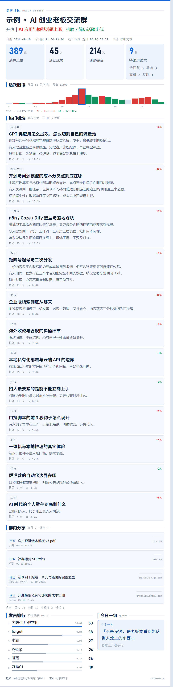

<div align="center">

# ChatPoster

### 把微信群聊，变成一张可以直接发回群里的图

点一个群，出一张图。图里写着这个群今天聊了什么。

[](LICENSE)
[](#-怎么用)
[](#-常见问题)



</div>

---

## 这是什么

微信群消息太多的时候，翻起来很累。**99+ 条消息，重要的那条往往夹在中间。**

ChatPoster 帮你把一天的消息读完，压成一张图。

- 打开就能看，**不用一条条翻**
- 图能**直接发回群里**，别人也能看
- **全在你自己的电脑上跑**，不联网、不上传

---

## 图上都有什么

| 位置 | 内容 |
|---|---|
| 最上面 | 群名、日期、一句话总结 |
| 四个大数字 | 消息总量、活跃成员、话题提及、待跟进线索 |
| 活跃时段 | 24 小时柱状图，一眼看出这个群几点最热闹 |
| 热门板块 | 今天聊的几个话题，每个都带要点和原话出处 |
| 群内分享 | 今天群里发的文件和链接（**只记名字和大小，不看内容**） |
| 发言排行 | 谁说得最多 |
| 今日一句 | 今天最值得记下来的一句话 |

**图上不会出现省略号。** 内容多就图长一点，不会把话截掉半句。

---

## 三套主题，三种性格

不是换个颜色那么简单。**字体、圆角、描边、投影、间距、装饰**整个换掉，
同一份数据出来是三张完全不同的图。

<table>
<tr>
<td align="center" width="33%" valign="top">
<br>
<b>暗夜鎏金</b><br>
<code>gold</code> · 默认<br>
<sub>黑底金线，等宽字<br>密、硬、像数据终端<br>适合科技群、晚上看</sub>
</td>
<td align="center" width="33%" valign="top">
<br>
<b>奶油卡通</b><br>
<code>kawaii</code><br>
<sub>奶油底，大圆角，粗描边<br>厚投影，像手账贴纸<br>适合宝妈群、生活群</sub>
</td>
<td align="center" width="33%" valign="top">
<br>
<b>办公科技</b><br>
<code>tech</code><br>
<sub>白底蓝灰，细线，无投影<br>像企业后台仪表盘<br>适合工作群、对外汇报</sub>
</td>
</tr>
</table>

| 主题 | 底色 | 强调色 | 字体 | 圆角 | 手感 |
|---|---|---|---|---|---|
| `gold` | 纯黑 | 金 `#d9a24b` | 等宽为主 | 12px | 硬朗、密集 |
| `kawaii` | 奶油 `#fff7ef` | 蜜橘 `#ff8a3d` | 圆体优先 | 26px | 圆润、有厚度 |
| `tech` | 纯白 | 科技蓝 `#1667d1` | 几何无衬线 | 9px | 克制、精确 |

用的时候指定一下就行：

```bash
python build.py data/my.json --theme kawaii
```

---

## 怎么用

### 先装东西

```bash
git clone https://github.com/JustinXai/chatposter.git
cd chatposter
pip install -r requirements.txt
```

> 需要电脑上装了 **微信 4.x 桌面版**，并且**已经登录过**（聊天记录得在你电脑里）。

### 三步出图

**第一步 · 找到微信的数据在哪**

```bash
python tools/find_data.py
```

它会告诉你一个路径，记下来。

**第二步 · 告诉程序这个路径**

```bash
# Windows（PowerShell）
$env:CHATPOSTER_WX_ROOT = "D:\Documents\xwechat_files"
```

```bash
# macOS / Linux
export CHATPOSTER_WX_ROOT="$HOME/Library/Containers/com.tencent.xinWeChat/Data/Documents/xwechat_files"
```

**第三步 · 出图**

最省事的办法是打开挂件：

```bash
python widget/app.py
```

然后浏览器打开 **http://127.0.0.1:8756** —— 左边是群列表，点一个，右边就出图。

> 第一次跑之前要先提密钥和解密（各跑一次就够了）：
> ```bash
> python tools/extract_key.py     # 需要管理员 / sudo 权限
> python tools/decrypt_db.py
> ```

也可以走命令行：

```bash
python tools/export_group.py              # 先看看有哪些群
python tools/export_group.py <群id>       # 给这个群出图
```

---

## 环境要求

| 项目 | 要求 |
|---|---|
| 系统 | Windows 10 以上（主力）、macOS |
| 微信 | **4.x 桌面版**，登录过、有聊天记录 |
| Python | 3.10 以上 |
| 浏览器 | Chrome 或 Edge（截图要用） |
| 权限 | 提密钥时需要管理员（Windows）/ sudo（macOS） |

```bash
pip install pycryptodome    # 解密用
pip install zstandard       # 非文本消息要它，建议装
pip install pillow          # 截图后裁掉多余空白
```

<details>
<summary><b>为什么建议装 zstandard？</b></summary>

微信把「文件、链接、小程序」这类消息压成了 zstd 格式。
不装 zstandard 的话解不开，"群内分享"那一段会是空的。
</details>

---

## 常用设置

改路径不用动代码，设个环境变量就行。

| 变量 | 作用 | 默认值 |
|---|---|---|
| `CHATPOSTER_WX_ROOT` | 微信数据在哪，多个用 `;` 隔开 | 自动找常见位置 |
| `CHATPOSTER_CHROME` | 用哪个浏览器截图 | 自动找 Chrome / Edge |
| `CHATPOSTER_ACCOUNT` | 指定哪个微信账号 | 第一个找到的 |
| `CHATPOSTER_PLAIN` | 解密结果放哪 | `out/wx_plain` |
| `CHATPOSTER_KEYS` | 密钥文件路径 | `out/wx_keys.json` |

---

## 文件说明

```
chatposter/
├── config.py           所有路径都在这里，不用去别处找
├── build.py            把数据填进模板，生成 HTML
├── poster.html         单图模板（三套主题都在里面）
├── index.html          带说明的长页版本
│
├── tools/
│   ├── find_data.py    找微信数据在哪
│   ├── extract_key.py  取密钥
│   ├── decrypt_db.py   解密数据库
│   ├── export_group.py 给某个群出图
│   └── make_demo.py    生成示例图
│
├── widget/
│   ├── app.py          挂件（浏览器里点群出图）
│   ├── pipe.py         取数 → 分析 → 出图
│   └── richmsg.py      处理文件、链接这类消息
│
├── data/analysis.sample.json   示例数据（虚构的）
└── docs/                       示例图和设置说明
```

**下面这些不会上传到 GitHub**（里面是你自己的聊天记录）：

```
out/wx_plain/      解密后的数据库
out/wx_dump/       导出的聊天文本
out/wx_keys.json   数据库密钥
out/daily-*.png    真实群的图
```

---

## 你的数据安全吗

安全。这个工具**只读**你自己的东西：

- ✅ 只从微信进程**读取**密钥，**不修改、不注入、不挂钩**
- ✅ 原数据库**只读**打开，不会动它
- ✅ **全程不联网**，不上传任何东西（挂件也只监听本机）
- ✅ 处理文件消息时**只看文件名和大小，不看内容**

> 唯一要提醒的：**图里是别人的发言**。
> 自己看没问题，发出去之前先想想合不合适。

---

## 常见问题

**Q：提示没有权限 / 打不开进程？**
A：提密钥需要管理员权限。Windows 上用管理员身份开终端，macOS 前面加 `sudo`。

**Q：解密完打不开数据库？**
A：多半是没跳过期的数据。重跑一次 `python tools/decrypt_db.py`。

**Q：图上有人显示"未知"？**
A：这个人的昵称格式比较特殊，没认出来。重新解密一次通常就好了。

**Q：文件、链接那一段是空的？**
A：`pip install zstandard`。

**Q：内容太多，能截断吗？**
A：故意不截断的。日报就是要看全，宁可图长一点。想短一点就少选几个话题。

**Q：能不能让它更聪明一点？**
A：可以。现在的分析是简单规则，接上 AI 效果会好很多（见下面 Roadmap）。

---

## 后面想做的

- [ ] 分析接 AI，话题归纳和摘要质量更好
- [ ] 图片原图解密
- [ ] 语音转文字
- [ ] 多个群一次出图

---

## English

**ChatPoster** turns WeChat group chat history into **one shareable image**.

Click a group, get a poster. It shows what the group talked about today.
Fully local — works offline, uploads nothing.

- **Output is an image**, ready to post back into the group
- **No truncation** — never cuts a sentence short, the poster just gets longer
- **Three themes** — `gold` (dark, data-terminal), `kawaii` (cream, sticker),
  `tech` (white/blue, dashboard). Not just colors: fonts, radii, borders,
  shadows and spacing all change with it.
- **Local-first** — never writes to or injects into the WeChat process

Works with WeChat 4.x on Windows and macOS.

```bash
pip install -r requirements.txt
python tools/find_data.py       # locate your WeChat data
python tools/extract_key.py     # read the DB key (read-only, needs admin)
python tools/decrypt_db.py      # decrypt to plain SQLite
python widget/app.py            # http://127.0.0.1:8756 — click a group
```

No real chat data is stored in this repository.

---

## License

[MIT](LICENSE)

仅供个人备份和回顾自己的聊天记录使用。请遵守当地法律和微信用户协议，
不要用来侵犯别人的隐私。使用风险自负。
