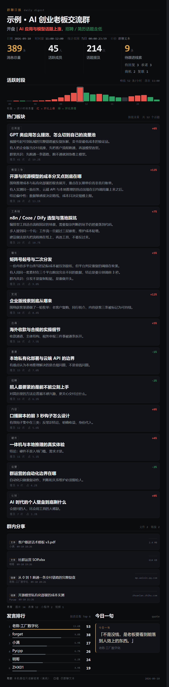

<div align="center">

# ChatPoster · 群聊日报图

**把微信群聊记录，变成一张可以直接发回群里的长图。**

一条本地链路：解密本机微信数据库 → 结构化分析 → 渲染成「宽固定 1080、高随内容」的日报长图。
全程离线，零配置，数据不出本机。

[](LICENSE)
[](#-环境要求)
[](#-微信-4x-支持说明)
[](#-环境要求)



*上图由 `poster.html` 内置的虚构示例数据渲染，不含任何真实聊天内容。*

</div>

---

## 这是什么

微信群消息一多，99+ 爬起来要命。但市面上的工具大多停在「导出成 HTML / Markdown / Excel」——
**导出来还得自己看**，发到群里更是没人点。

ChatPoster 做的是最后一公里：**直接给你一张图**。

点一个群，出一张图。图可以直接发回群里，手机上全宽扫一眼就知道今天这群聊了什么。

```
 本机微信库(加密)          解密            结构化分析              渲染
┌──────────────┐    ┌──────────────┐   ┌──────────────┐   ┌──────────────┐
│ message_0.db │───▶│  纯 SQLite   │──▶│  analysis.json│──▶│  daily.png   │
│ SQLCipher 4  │    │  (只读副本)   │   │   话题/排行/  │   │ 1080 × N px  │
│ page 4096    │    │              │   │   金句/分享物 │   │  直接发群     │
│ reserve 80   │    └──────────────┘   └──────────────┘   └──────────────┘
└──────────────┘           │                   │                  │
      ▲                    │                   │                  │
   密钥提取                 │                   │                  │
  (只读进程内存)             └───────────────────┴──────────────────┘
                                    全程离线 · 不联网 · 不发消息
```

**核心特点：**

| | |
|---|---|
| 🖼️ **输出是图，不是文档** | 宽固定 1080，高随内容。手机上全宽可读，发群即用 |
| ✂️ **零省略** | 全站不设 `line-clamp`、不用省略号。宁可图长，也要信息完整 |
| 🔒 **本地优先** | 不联网、不上传、不注入微信进程。密钥与聊天记录只在本机 |
| 🧩 **三层解耦** | 取数 / 分析 / 渲染各自独立，可以只换其中一层 |
| 📎 **非文本也算数** | 文件、链接、图片、小程序、视频号会统计进来（只取名字与体积，不读内容） |
| 🪶 **依赖极轻** | 渲染层只要 Python 标准库 + Chrome；解密层才需要 pycryptodome |

---

## 三分钟上手

```bash
git clone https://github.com/JustinXai/chatposter.git
cd chatposter
pip install -r requirements.txt
```

### 第一步 · 找到微信数据目录

```bash
python tools/find_data.py
```

它会打印出本机 `xwechat_files` 的实际位置。找到后告诉程序：

```bash
# Windows PowerShell
$env:CHATPOSTER_WX_ROOT = "D:\Documents\xwechat_files"

# macOS / Linux
export CHATPOSTER_WX_ROOT="$HOME/Library/Containers/com.tencent.xinWeChat/Data/Documents/xwechat_files"
```

### 第二步 · 提取密钥并解密

```bash
# 1) 从正在运行的微信进程内存里，只读取出数据库密钥
python tools/extract_key.py

# 2) 用密钥把库解密成本机可读的 SQLite 副本
python tools/decrypt_db.py
```

> **需要管理员 / sudo 权限**，因为要读取微信进程内存。
> 全程只调用 `ReadProcessMemory`，**不写入、不注入、不挂钩、不修改微信**。

### 第三步 · 出图

**方式 A｜挂件（推荐）**

```bash
python widget/app.py
# 浏览器打开 http://127.0.0.1:8756
# 左边选一个群 → 点「生成日报图」→ 右边出图
```

**方式 B｜命令行**

```bash
# 先列出有哪些群
python tools/export_group.py

# 指定群 id 出图（群 id 是 ASCII，不会踩中文路径的坑）
python tools/export_group.py 12345678@chatroom --hours 24
```

**方式 C｜只跑渲染层**

不需要微信，只要你有一份符合契约的 JSON：

```bash
python build.py data/analysis.sample.json -t poster.html -o out/my.html
```

---

## 目录结构

```
chatposter/
├── config.py               ← 全局配置。所有本机路径都可被环境变量覆盖
├── build.py                ← 渲染层：字段契约硬校验 + 口径自洽软校验 + 注入模板
├── poster.html             ← 单图模板（宽 1080 / 高随内容）
├── index.html              ← 学习版长页，含完整的数据契约说明
├── requirements.txt
│
├── tools/
│   ├── find_data.py        · 定位微信数据目录（只读扫描）
│   ├── extract_key.py      · 从微信进程内存提取 SQLCipher 密钥（只读）
│   ├── decrypt_db.py       · 解密数据库 + 合并 WAL（原库只读）
│   ├── export_group.py     · 导出指定群近 N 小时记录并出图
│   └── make_demo.py        · 用内置虚构数据生成 docs/demo.png
│
├── widget/
│   ├── app.py              · 本地挂件服务（127.0.0.1:8756）
│   ├── pipe.py             · 流水线：取数 → 分析 → 出图
│   └── richmsg.py          · 非文本消息解码（文件/链接/图片计数）
│
├── data/
│   └── analysis.sample.json  · 唯一入库的分析稿，纯虚构
└── docs/
    └── demo.png              · 脱敏示例图
```

**不进仓库的东西**（`.gitignore` 三重防线）：

```
out/wx_plain/     解密后的数据库 —— 你的聊天记录全文
out/wx_dump/      导出的群聊文本
out/wx_keys.json  数据库密钥
out/daily-*.png   真实群的出图
data/analysis-*.json（除 sample 外）
```

---

## 环境要求

| 项目 | 要求 |
|---|---|
| 操作系统 | Windows 10+（主）、macOS（次） |
| 微信 | **4.x 桌面版**，已登录且有本地聊天记录 |
| Python | 3.10 及以上 |
| 浏览器 | Chrome / Edge（无头截图用） |
| 权限 | 提取密钥时需要管理员（Windows）/ sudo（macOS） |

```bash
pip install pycryptodome        # 解密用
pip install zstandard           # 非文本消息解压（强烈建议装）
pip install pillow              # 截图后按底色裁边
```

> **不装 zstandard 会怎样？** 非文本消息（文件、链接、小程序）的 `message_content`
> 是 zstd 帧，解出来全是乱码，"群内分享"板块会空掉。装了才有 94 条全部还原的体验。

### 可配置项

所有路径都走环境变量，不必改代码：

| 变量 | 作用 | 默认 |
|---|---|---|
| `CHATPOSTER_WX_ROOT` | 微信数据根目录，多个用 `;` 分隔 | 自动探测常见位置 |
| `CHATPOSTER_ROOT` | 项目根 | 脚本所在目录 |
| `CHATPOSTER_PLAIN` | 解密产物输出目录 | `out/wx_plain` |
| `CHATPOSTER_KEYS` | 密钥文件路径 | `out/wx_keys.json` |
| `CHATPOSTER_CHROME` | 指定浏览器可执行文件 | 自动探测 Chrome / Edge |
| `CHATPOSTER_ACCOUNT` | 指定微信账号目录 | 取第一个已解密的 |

---

## 数据契约

渲染层只认结构、不认内容。JSON 长这样（完整版见 `data/analysis.sample.json`）：

```jsonc
{
  "meta":    { "group": "群名", "date": "2026-09-10", "window": "11:00-12:00",
               "range": "近 24 小时", "scope": "群聊文本", "headline": "一句话导语" },
  "stats":   [ { "key": "消息总量", "value": 389, "unit": "条", "hi": true }, ... ],
  "signals": { "reply": 3, "promise": 3, "opportunity": 2, "revive": 1 },
  "hours":   [0, 1, 0, 0, 2, ...],          // 必须是 24 个数
  "topics":  [ { "tag": "应用层", "title": "...", "mentions": 41, "delta": 0.06,
                 "summary": ["要点 1", "要点 2"], "quote": "金句", "sources": [...] } ],
  "ranking": [ { "name": "昵称", "msgs": 53 }, ... ],
  "quote":   { "label": "今日一句", "text": "「...」", "from": "—— 昵称" },
  "shares":  { "counts": {...}, "files": [...], "links": [...] }
}
```

`build.py` 会做两道体检，**不合格不出图**：

1. **字段契约（硬）** —— 缺字段、类型不对、`hours` 不是 24 个，直接中止，不生成半张报
2. **口径自洽（软）** —— 各模块数字能不能互相反算。比如柱子合计必须等于「消息总量」卡片，
   峰值小时必须和「活跃时段」标注一致。不一致只告警，但建议核对

---

## 微信 4.x 支持说明

微信 4.x 用 SQLCipher 4 加密本地库，参数是实测出来的：

| 参数 | 值 |
|---|---|
| 分页大小 | 4096 |
| 保留区 | 80 字节 = IV(16) + HMAC(64) |
| `enc_key` | **32 字节裸 key 直接作 AES-256 密钥**（注意：不做 PBKDF2） |
| `mac_key` | `PBKDF2-HMAC-SHA512(enc_key, salt ^ 0x3A, 2 轮, 32 字节)` |
| 校验 | `HMAC-SHA512(mac_key, page1[16:4032] + LE32(1))` 对比 `page1[4032:4096]` |

密钥提取走 WCDB 的配置对象：

```
"com.Tencent.WCDB.Config.Cipher" 字符串锚点
   → [名字指针8B][名字长度8B] 对
   → 命中点 -0x10 为配置节点
   → 节点 +0x28 得配置对象
   → 对象 +0x88 得 { +0x8: 数据指针, +0x10: 长度 }
   → 数据块与 32 字节固定掩码异或
   → 明文 x'<64hex 密钥>[<32hex 盐>]'
```

**消息表结构**：每个群一张表，表名是 `Msg_<md5(群id)>`。
发送者的权威来源是**正文前缀**（`<发送者标识>: 正文`），而不是 `real_sender_id`——后者会导致名字张冠李戴。

**几个已踩过的坑，写在这里省你时间：**

- **WAL 必须过滤帧盐。** 预分配的 WAL 里残留着旧世代的帧，不过滤会写进过期页，
  解出来的库直接 `malformed`。只合并帧盐与 WAL 头一致的帧。
- **`real_sender_id` 不可信**，用正文前缀 + alias 映射还原昵称。
- **引用消息（appmsg type 57）要丢弃**，否则会被误判成链接分享。
- **文件判定要收紧**，否则 `0.22` 会被当成 `.22` 后缀的文件。用扩展名白名单 + `<totallen>` 双重确认。
- **微信 4.1.12+ 的 UI Automation 路线是死的**（Qt Quick 自绘，无障碍树里零控件），别走。

---

## 隐私边界

这个项目处理的是**你自己的**聊天记录。请把这条线守住：

- ✅ **只读**微信进程内存（`PROCESS_VM_READ | PROCESS_QUERY_INFORMATION`），不写、不注入、不挂钩
- ✅ 原库**只读**打开，解密副本只写本机工作区
- ✅ 渲染层只产出**文件名、链接标题、体积、发送者**，**绝不读取或落盘任何文件内容**
- ✅ 不联网、不上传、不调用任何外部 API（挂件只监听 `127.0.0.1`）
- ✅ 仓库里**不含任何真实聊天数据**，示例图与示例 JSON 全部为虚构
- ❌ 不要把 `out/wx_plain/`、`out/wx_keys.json`、真实群的 `daily-*.png` 提交到任何仓库
- ❌ 不要在未经群成员同意的情况下，把日报图对外发布

> 导出的是别人的发言。可以自己看，不等于可以到处发。

---

## 常见问题

**Q：提取密钥时报「打不开进程」？**
A：需要管理员权限。Windows 上以管理员身份运行终端；macOS 上用 `sudo`。

**Q：解出来的库打不开 / `malformed`？**
A：多半是 WAL 没过滤帧盐。检查 `decrypt_db.py` 里的 `merge_wal()`，只合并盐值匹配的帧。

**Q：群消息里发送者显示「未知」？**
A：正文前缀匹配失败。检查 `pipe.py` 的 `split_sender()`，某些客户端的正文前缀混有二进制杂字符，需要走兜底分支。

**Q：非文本消息全是乱码？**
A：装 `zstandard`。这些消息的 `message_content` 是 zstd 帧。

**Q：图上内容太多，能截断吗？**
A：**故意不做截断。** 日报的价值在于信息完整，宁可图长。要控长请减条目或换版面，
不要用省略号——这是本项目的硬规矩。

**Q：能接 LLM 提升分析质量吗？**
A：可以。分析层（`pipe.py` 的 `analyze()`）目前是规则版，输出的是标准 JSON。
把这一层换成 LLM，渲染层不用动。

---

## Roadmap

- [ ] 分析层接入 LLM（话题归纳、金句挑选、摘要质量）
- [ ] 图片原图解密（`aeskey` + WCDB 配置对象派生）
- [ ] 语音 SILK 转码 + 本地 ASR
- [ ] 敏感议题的过滤策略（可配置）
- [ ] 多群批量出图 + 定时任务

---

## English

**ChatPoster** turns WeChat group chat history into **one shareable image**.

A fully local pipeline: decrypt the local WeChat 4.x database → structure the conversation
→ render a "fixed width 1080px, height follows content" daily digest poster.

- 🖼️ **Output is an image, not a document** — ready to post back into the group
- ✂️ **Zero truncation** — no `line-clamp`, no ellipsis. The digest is meant to be complete
- 🔒 **Local-first** — offline, no upload, no process injection
- 🧩 **Three decoupled layers** — fetch / analyze / render, swap any one of them
- 📎 **Non-text aware** — files, links, images and mini-programs are counted (names only, contents never read)

Works on WeChat 4.x (SQLCipher 4, page 4096, reserve 80). macOS and Windows supported.

```bash
pip install -r requirements.txt
python tools/find_data.py          # locate your WeChat data
python tools/extract_key.py        # read the DB key from process memory (read-only)
python tools/decrypt_db.py         # decrypt to plain SQLite
python widget/app.py               # http://127.0.0.1:8756 — click a group, get a poster
```

**Security:** this project reads its own WeChat data. It never writes to or injects into
the WeChat process, never touches the network, and never reads the contents of shared files.
No real chat data is stored in this repository.

---

## License

[MIT](LICENSE)

本工具仅供个人数据备份与自我回顾使用。请遵守当地法律法规及微信用户协议，
不得用于任何非法用途，不得侵犯他人隐私。使用风险自负。
